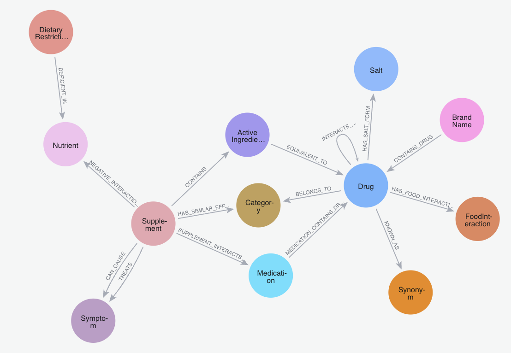

# Supplement Safety Knowledge Graph Structure

## Overview
A Neo4j knowledge graph integrating three biomedical data sources to identify dangerous
interactions between supplements and medications, detect nutrient deficiencies, and
surface evidence-based supplement recommendations.

**Total Nodes:** 329,849  
**Total Relationships:** 3,447,235

---

## Data Sources

### DrugBank
Comprehensive drug information including drug-drug interactions, active ingredients, and pharmacological effects.

| Node | Relationship | Node |
|------|--------------|------|
| Drug | INTERACTS_WITH | Drug |
| Drug | BELONGS_TO | Category |
| Drug | KNOWN_AS | Synonym |
| Drug | HAS_SALT_FORM | Salt |
| Drug | HAS_FOOD_INTERACTION | FoodInteraction |
| BrandName | CONTAINS_DRUG | Drug |

**Nodes:** Drug, Category, Synonym, Salt, BrandName, FoodInteraction

---

### Mayo Clinic
Supplement safety ratings, treatment applications, and supplement-medication interactions; web-scraped from Mayo Clinic.

| Node | Relationship | Node |
|------|--------------|------|
| Supplement | SUPPLEMENT_INTERACTS_WITH | Medication |
| Supplement | CONTAINS | ActiveIngredient |
| Supplement | HAS_SIMILAR_EFFECT_TO | Category |
| Supplement | TREATS | Symptom |
| Supplement | CAN_CAUSE | Symptom |
| ActiveIngredient | EQUIVALENT_TO | Drug |
| Medication | MEDICATION_CONTAINS_DRUG | Drug |

**Nodes:** Supplement, ActiveIngredient, Medication, Symptom

---

### Curated Nutritional Data
Nutrient deficiencies, dietary restrictions, medication-nutrient interactions, and supplement depletion effects; aggregated from academic sources including NIH and MedlinePlus.

| Node | Relationship | Node |
|------|--------------|------|
| DietaryRestriction | DEFICIENT_IN | Nutrient |
| Supplement | NEGATIVE_INTERACTION | Nutrient |
| Drug | INTERACTS_WITH_NUTRIENT | Nutrient |

**Nodes:** DietaryRestriction, Nutrient
---
